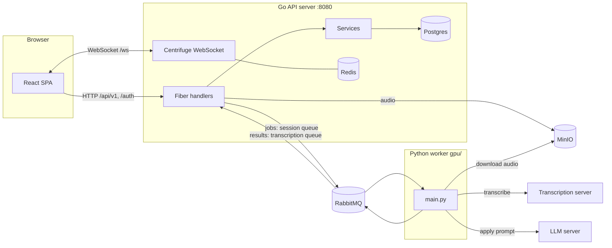

# TINA — Architecture & Structure

TINA is a session recording and transcription platform. Users record or upload audio in a **session**, the audio is transcribed asynchronously by a queue-driven worker, transcripts stream to participants live over WebSockets, and configurable **prompts** (LLM instructions, optionally tied to a session's **purpose**) can be applied to a session's transcript to produce analysis such as summaries or reports.

## System overview

The platform consists of three applications and four infrastructure services:

| Component | Technology | Location | Role |
|---|---|---|---|
| API server | Go 1.25 (Fiber, GORM, Centrifuge) | `cmd/platform`, `internal/`, `pkg/` | HTTP API, WebSockets, business logic, serves the built frontend |
| Frontend | React 19 + TypeScript + Vite | `frontend/` | Single-page app: recording, live transcripts, session management, prompt results |
| Worker | Python (`pika`, `requests`) | `gpu/` | Consumes queue jobs: transcribes audio and applies LLM prompts to transcripts |
| Postgres | Docker (`docker-compose.yml`) | — | Primary database (schema managed by GORM `AutoMigrate`) |
| Redis | Docker | — | Centrifuge broker + presence (WebSocket pub/sub across instances) |
| RabbitMQ | Docker | — | Job/result queues decoupling the API from the worker |
| MinIO | Docker | — | S3-compatible object storage for recorded/uploaded audio |

The worker additionally calls two **external, self-hosted model servers** that are not part of this repository, both speaking OpenAI-compatible HTTP APIs:

- a transcription server (`/v1/audio/transcriptions`, e.g. speaches / faster-whisper / whisper.cpp) — `TRANSCRIPTION_API_URL`
- a chat-completions LLM server (`/v1/chat/completions`, e.g. LM Studio, Ollama, vLLM) — `LLM_API_URL`



## Repository layout

```
cmd/platform/main.go      Entrypoint: config, DB, Redis, RabbitMQ, MinIO, Centrifuge,
                          route registration, SPA fallback for frontend/dist
internal/
  router.go               All route registration (see "HTTP API" below)
  config/                 Env-var-driven configuration (no config files)
  handler/                Fiber HTTP handlers, one file per resource/action
  service/                Business logic: auth, user, session, prompt, purpose
  database/               Connection + AutoMigrate; models/ holds GORM models
  queue/                  Queue message structs; handler/ consumes worker results
  websocket/              Centrifuge setup, channel naming/auth, publish helpers
pkg/                      Reusable helpers: rabbitmq client, apperror, env, logger
frontend/                 React SPA (see "Frontend" below)
gpu/                      Python worker (see "Worker" below)
docker-compose.yml        Postgres, Redis, RabbitMQ (+mgmt UI :15672), MinIO (+console :9001)
sample.env                Template for the shared root .env (Go server + Python worker)
start-worker.sh           Start the Python worker in the background (PID/log in gpu/)
stop-worker.sh            Stop it gracefully
```

## Go backend

### Request flow and layering

`internal/router.go` registers routes → `internal/handler/*` (thin Fiber handlers: parse/validate request, call services, shape response) → `internal/service/*` (business logic) → `internal/database/models` (GORM), `pkg/rabbitmq`, MinIO, or Centrifuge. **Handlers do not talk to the database directly**; that goes through services.

Errors: `pkg/apperror.Check(err)` is for startup/fatal errors only (it exits the process) — never used inside request handlers. Validation errors from `go-playground/validator` are formatted via `apperror.ParseValidationError`.

### HTTP API

Route groups (all registered in `internal/router.go`):

- `/auth` — `me`, `refresh`, `methods`; `/auth/local/*` (login/register/change-password) and `/auth/azure/*` (OAuth flow) are independently feature-flagged
- `/api/v1/users` — online presence
- `/api/v1/prompts` — CRUD for the prompt catalog
- `/api/v1/purposes` — list purposes (a purpose bundles retention/limitation rules and an optional auto-applied prompt)
- `/api/v1/sessions` — create, upload, active/history, detail, members/participants, segments, end/finish, speaker names, and prompt results (`GET/POST /:id/prompts`, `DELETE /:id/prompts/:resultId`)
- `/api/v1/admin` — user/role management, purpose CRUD, re-transcription, RabbitMQ inspection, notifications

Auth is JWT-based (HS256, claims: `user_id`, `email`, `role`), issued and validated by `internal/service/auth.go`. `JWTMiddleware()` stores claims in the request context; handlers read them via `AuthService.GetProfile(c)`. Roles are `user`/`admin`; there is **no role-check middleware** — admin routes enforce the role per-handler. WebSocket handshakes use a separate `WSAuthMiddleware` (token as query parameter).

In production the Go binary serves `frontend/dist` as a SPA and falls back to `index.html` for any non-API path — the `apiPrefixes` list in `cmd/platform/main.go` decides what is "API"; a new top-level route prefix must be added there or the SPA fallback swallows it.

### Data model

GORM models in `internal/database/models/`, migrated purely via `AutoMigrate` in `database.RunMigrations()` (no migration files — new models must be added to that call list):

- `User`, `UserRole` — accounts and platform roles
- `Session` — a recording/upload session, including its accumulated transcription; `UserXSession` links participants; `SessionSegment` and `SessionUpload` track audio objects in MinIO; `TranscriptLine` stores per-line transcripts
- `Purpose` (+ `PurposeRetentionPeriod`, `PurposeLimitations`) — the "why" of a session, optionally linked to a prompt that is auto-applied after transcription
- `Prompt` — a reusable LLM instruction
- `SessionPromptResult` — one application of a prompt to a session (`queued` → `completed`/`failed`, with `Result`/`Error` text)

### Real-time layer

Centrifuge (`internal/websocket/`) provides WebSocket pub/sub, with Redis as broker and presence manager so multiple API instances can share state. Channels are `session:{id}` (live transcript lines, participant join/leave) and `user:{id}` (personal notifications); `channels.go`/`validate.go` control naming and subscription permission. `publish.go` and `notifications.go` are the outbound helpers used by handlers and queue consumers.

## Async pipelines (RabbitMQ)

Two durable queues, declared by the Go server at startup and used with the default exchange (routing key = queue name):

- **`session`** — jobs from the API to the worker
- **`transcription`** — results from the worker back to the API

All messages are JSON with a `type` field; consumers dispatch on it. Message structs live in `internal/queue/` and are the contract both sides must match.

### Transcription pipeline

1. The client records mic audio as raw PCM16LE mono 16kHz segments (`frontend/src/lib/audio.ts`) or uploads a complete audio file; handlers store the bytes in MinIO and publish `segment_ready` / `upload_ready` / `recording_ready` / `upload_finalize` to the `session` queue.
2. `gpu/main.py` downloads the audio from MinIO, wraps raw PCM segments in a WAV header (`gpu/wav.py`), and transcribes via a swappable `TranscriptionProvider` (`gpu/transcription/`, selected by `TRANSCRIPTION_PROVIDER`; the only implementation is `openai_compatible`). For whole-session batch jobs it transcribes each participant's segments individually and tags them `speaker = user_id` — segments are already partitioned per user, so no diarization is needed.
3. The worker publishes `segment_transcribed` / `session_transcribed` / `upload_transcribed` to the `transcription` queue; `internal/queue/handler/transcription.go` updates the session via `SessionService` and broadcasts new transcript lines over Centrifuge.

(The `POST /sessions/:id/segments/:segmentId/result` HTTP callback with `WHISPER_CALLBACK_TOKEN` is a legacy/alternate result path the current worker does not use.)

### LLM prompt pipeline

1. A user applies a prompt (`POST /api/v1/sessions/:id/prompts`), or `queuePurposePrompt` auto-applies the session's purpose-prompt right after transcription completes. Either path creates a `SessionPromptResult` row (status `queued`) and publishes a `prompt_apply` message to the `session` queue — the message embeds the prompt text and full transcript, so the worker needs no DB or MinIO access.
2. The same worker process handles the job via a swappable `LLMProvider` (`gpu/llm/`, selected by `LLM_PROVIDER`; the only implementation is `openai_compatible`): the prompt is sent as the system message and the transcript as the user message. The provider is lazily initialized, so transcription-only deployments need no `LLM_*` configuration.
3. The worker publishes a flat `prompt_applied` message (fields per `internal/queue/prompt.go`; `result` on success, `error` on failure — failures are always reported, never silently dropped) to the `transcription` queue. The Go consumer updates the `SessionPromptResult` row and notifies session members over Centrifuge. The frontend currently shows a toast and loads results on page load/apply (no live in-place update yet).

## Worker (`gpu/`)

A single-threaded Python process (`gpu/main.py`, run via `./start-worker.sh` or `python main.py` from `gpu/`): one blocking RabbitMQ consumer that dispatches on message `type` and handles jobs sequentially with `auto_ack` (a crashed job is logged, not retried). Supporting modules: `storage.py` (MinIO download), `wav.py` (PCM→WAV), `transcription/` and `llm/` (provider registries — add a new backend by implementing the ABC in `base.py` and registering it in `registry.py`). Dependencies in `gpu/requirements.txt`, virtualenv expected at `gpu/.venv`.

## Frontend (`frontend/`)

- **Page convention**: each route `src/pages/<Name>.tsx` has a matching folder `src/pages/<name>/` with its own `api.ts`, `hooks/`, `components/`, `types.ts`. Page-specific code stays in that folder; only genuinely shared code goes in `src/lib` / `src/components`.
- **Shared session state**: `src/contexts/session/` — `actions/` are imperative operations (join session, start/stop recording, hydrate transcripts); `event-handlers/` react to incoming Centrifuge events (`useSessionChannelHandlers` for `session:{id}`, `useUserChannelHandlers` for `user:{id}`).
- **WebSocket client**: `src/lib/centrifuge.ts` connects to `/ws`.
- **UI primitives**: `src/components/ui/` are shadcn/Radix components (style "new-york"); extend via shadcn conventions.
- **Path alias**: `@/*` → `frontend/src/*`.
- In dev, Vite proxies `/auth` and `/ws` to the Go server on `localhost:8080`; `npm run build` outputs `frontend/dist`, served directly by the Go binary in production.

## Configuration

All configuration comes from environment variables — there are no config files. One shared `.env` at the repo root is loaded by both the Go server (`godotenv`) and the Python worker (`python-dotenv`); the frontend has its own `frontend/.env`. Copy `sample.env` → `.env` and `frontend/sample.env` → `frontend/.env` to get started.

Key groups: `DB_*` (Postgres), `REDIS_*`, `RABBITMQ_*` (including the worker's `RABBITMQ_IN_QUEUE`/`RABBITMQ_OUT_QUEUE`, defaulting to `session`/`transcription`), `MINIO_*`, `TRANSCRIPTION_*` (which transcription server the worker calls), `LLM_*` (which chat-completions server it uses for prompts), `JWT_*`, `OAUTH_ENCRYPTION_KEY`/`AZURE_*` (OAuth), and `FEATURE_*` flags that gate whole route groups at startup (local auth, Azure auth, registration, WebSockets).

## Running the stack locally

```bash
docker compose up -d                 # Postgres, Redis, RabbitMQ, MinIO
go run ./cmd/platform                # API server on :8080 (needs root .env)
cd frontend && npm run dev           # Vite dev server with proxy
./start-worker.sh                    # Python worker (needs gpu/.venv and root .env)
# plus, run separately (outside this repo):
#   a transcription server at TRANSCRIPTION_API_URL
#   an LLM server at LLM_API_URL (e.g. LM Studio on :1234)
```
