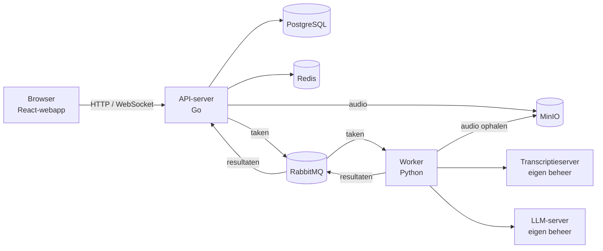

# TINA transcriptie

**Transcriptietool, ontwikkeld door en voor overheidsorganisaties.**

TINA neemt gesprekken op of verwerkt geüploade audio, zet die automatisch om in een transcript en maakt daar met een taalmodel een gespreksverslag van. TINA is ontworpen om veilig, modulair en schaalbaar transcriptie in de organisatie beschikbaar te stellen. Mag data uit gesprekken de organisatie niet verlaten? Dan kan dat. Er is maximale regie over je data. Als dat nodig is, gebeurt alle verwerking  in de eigen omgeving: audio, transcripten en verslagen blijven daar, en TINA gebruikt geen externe (cloud-)API's.

> [!CAUTION]
> TINA is een **MVP** (minimum viable product) en nog niet volledig klaar voor productiegebruik. Er is nog geen penetratietest uitgevoerd en er staan nog bekende fouten open, onder meer bij het opruimen van data volgens bewaartermijnen. Zie [Bekende beperkingen](#bekende-beperkingen).

## Inhoud

- [Waarom TINA?](#waarom-tina)
- [Wat doet TINA?](#wat-doet-tina)
- [Hoe is TINA tot stand gekomen?](#hoe-is-tina-tot-stand-gekomen)
- [Status en beheer](#status-en-beheer)
- [Architectuur in het kort](#architectuur-in-het-kort)
- [Installatie](#installatie)
- [Gebruik in het kort](#gebruik-in-het-kort)
- [Bekende beperkingen](#bekende-beperkingen)
- [Bijdragen en contact](#bijdragen-en-contact)
- [Licentie](#licentie)

## Waarom TINA?

Binnen de overheid wordt veel vergaderd en vertrouwelijke gesprekken gevoerd. Denk daarbij aan gesprekken met kwetsbare doelgroeppen. Vaak is een verslag van die overleggen nodig en verslaglegging kost veel tijd. Niet alleen dat door een hoge werkdruk die er soms bij in schiet, gesprekken vragen veel aandacht van de verslaglegger. Daardoor is er minder focus op je gesprekspartner.

Er zijn veel transcriptieoplossingen op de markt, maar die werken vooral goed als er accentloos Nederlands of Engels wordt gesproken. Voor gevoelige en vertrouwelijke gesprekken zijn ze binnen de overheid meestal niet veilig te gebruiken, omdat niet transparant is waar de gegevens worden verwerkt en waar ze terechtkomen.

TINA wil ervoor zorgen dat gegevens binnen de muren van de eigen organisatie blijven, dat medewerkers minder tijd kwijt zijn aan handmatige verslaglegging en dat verslagen beter en uniformer worden. De controle over de gegevens blijft daarbij binnen de publieke sector. TINA ondersteunt medewerkers bij het veilig uitwerken van fysieke en online vergaderingen, interviews en andere overlegvormen, en kan ook dictaten verwerken. Bij de ontwikkeling is nadrukkelijk rekening gehouden met de AVG, informatiebeveiliging en datasoevereiniteit.

## Wat doet TINA?

**Live opnemen in de browser**  
Deelnemers aan een sessie nemen op via hun eigen microfoon. Het transcript verschijnt tijdens het gesprek live bij alle deelnemers, per regel gelabeld met de deelnemer die sprak.

**Audiobestanden uploaden**  
Audiobestanden worden op de achtergrond getranscribeerd.

**Verslagen en analyses met prompts**  
Een prompt is een herbruikbare instructie voor het taalmodel, zoals 'Samenvatting' of 'Actiepunten'. Beheerders onderhouden een centrale promptcatalogus en gebruikers kunnen hun eigen prompts maken.

**Doelen (purposes)**  
Elke sessie heeft een doel. Het doel legt de bewaartermijn vast, bepaalt of uitnodigen en app-opname zijn toegestaan en kan een prompt bevatten die automatisch draait zodra de transcriptie klaar is.

**Samenwerken in een sessie**  
Je kunt collega's uitnodigen met de rol *editor* (bewerken en uitnodigen) of *viewer* (alleen lezen). De eigenaar van een sessie heeft de rol *owner*.

**Transcript bewerken en exporteren**  
Je kunt sprekerlabels hernoemen (bijvoorbeeld 'Cliënt' of 'Interviewer') en het transcript kopiëren of downloaden als tekst.

**Inloggen**  
Voor authenticatie maakt TINA gebruik van een lokaal account (e-mail en wachtwoord) en/of met Microsoft Entra-ID. Beide methoden zijn apart aan en uit te zetten.

**Beheerpaneel**  
Geautoriseerde gebruikers kunnen gebruik maken van het beheerpaneel voor het aanmaken van gebruikers en rollen, prompts, doelen, sessiebeheer (inclusief opnieuw transcriberen), wachtrij beheer en berichten aan gebruikers.

### Data blijft in eigen beheer

Alle onderdelen draaien in eigen beheer: de applicatie, de database, de opslag van audio en ook de modelservers voor spraakherkenning en tekstanalyse. TINA spreekt die modelservers aan via een *OpenAI-compatibele* API. Die term slaat alleen op het formaat van de API. TINA gebruikt geen diensten van OpenAI of van andere externe aanbieders.

Inloggen via Azure AD is de enige uitzondering. Zet je die optie aan, dan verloopt de authenticatie via Microsoft. Audio, transcripten en verslagen gaan daar niet naartoe.

### Talen

Welke talen en dialecten TINA herkent, hangt af van het spraak-naar-tekstmodel dat je koppelt (instelbaar via `TRANSCRIPTION_MODEL` en `TRANSCRIPTION_LANGUAGE`). Binnen het project heeft NHL Stenden een spraak-naar-tekstmodel voor het Fries getraind. Dat model valt buiten deze repository en wordt beheerd door NHL Stenden. Kijk op [https://github.com/imaihub/tina-transcription-api](https://github.com/imaihub/tina-transcription-api). 
## Hoe is TINA tot stand gekomen?

TINA is ontwikkeld onder regie van [gemeente Leeuwarden](https://www.leeuwarden.nl), samen met [gemeente Groningen](https://gemeente.groningen.nl) en [NHL Stenden Hogeschool](https://www.nhlstenden.com). Het project is mede mogelijk gemaakt door het [**Innovatiebudget Digitale Overheid 2025**](https://www.digitaleoverheid.nl/overzicht-van-alle-onderwerpen/innovatie/innovatiebudget/) van het ministerie van Binnenlandse Zaken en Koninkrijksrelaties (BZK).

Het team heeft TINA stap voor stap en agile ontwikkeld, in nauwe samenwerking met de praktijk. Bij het ontwikkelen en testen zijn de behoeften van gebruikers meegenomen, en ook die van inwoners uit een kwetsbare doelgroep. Naast het Nederlands richtte het project zich op het Fries en regionale dialecten. Het team heeft vele uren aan verzameld audiomateriaal geanalyseerd en met de hand getranscribeerd om een Fries taalmodel te trainen. TINA is opgezet volgens de Common Ground-gedachte: modulair, als herbruikbare voorziening die organisaties zelf kunnen inzetten.

**Resultaten van het project:**

- de TINA-transcriptieapplicatie (deze repository),
- een getraind spraak-naar-tekstmodel voor het Fries (beheerd door NHL Stenden),
- een onderzoeksverslag over het ontwikkelen van spraak-naar-tekstmodellen voor kleine talen en dialecten,
- een onderzoek onder inwoners naar de bereidheid om mee te doen aan automatische gesprekstranscriptie. In een enquête onder 500 bijstandsgerechtigden gaf ruim 80% aan geen probleem te hebben met veilige transcriptieondersteuning bij de gevoelige bijstandsgesprekken.

**Eerste praktijkervaringen**  
Volgens de gebruikers bespaart TINA per overleg tot ruim een half uur aan verslaglegging. In kwalitatieve zin wordt de grootste winst behaald. Gebruilkers ervaren de verslagen als uniformer, nauwkeuriger en objectiever. En vooral dat ze meer aandacht hebben voor het gesprek en hun gesprekspartner. De automatisch gemaakte verslagen zijn al een goede basis, maar menselijke controle en correctie blijft nodig.

## Status en beheer

- Met het Innovatiebudget is een MVP van het transcriptieplatform gerealiseerd.
- Gemeente Leeuwarden test TINA lokaal bij enkele afdelingen en secretariaten. Het team verwerkt eerst die gebruikersfeedback, en daarna pas zetten de andere samenwerkingspartners (en organisaties daarbuiten) TINA in.
- Voor het transcriptieproces binnen Werk & Inkomen (Sociaal Domein) is een DPIAMA (DPIA en IAMA) opgesteld.
- Voordat TINA in productie kan, is onder meer een penetratietest nodig.
- Beheeraspect: ondanks dat project TINA geen actieve ontwikkelcapaciteit meer heeft, zal gemeente Leeuwarden maintainer van deze repository (het TINA-platform) zijn. NHL Stenden is maintainer van het getrainde spraak-naar-tekstmodel.

## Architectuur in het kort

TINA bestaat uit drie applicaties en vier infrastructuurdiensten:

| Onderdeel | Technologie | Rol |
|---|---|---|
| API-server | Go 1.25 (Fiber, GORM, Centrifuge) | HTTP-API, WebSockets en businesslogica; serveert ook de webinterface |
| Frontend | React 19, TypeScript, Vite | Webapplicatie voor opnemen, live transcript, sessiebeheer en verslagen |
| Worker | Python | Verwerkt taken uit de wachtrij: audio transcriberen en prompts toepassen |
| PostgreSQL | Docker | Database |
| Redis | Docker | Broker voor WebSocket-berichten (Centrifuge) |
| RabbitMQ | Docker | Wachtrijen tussen API-server en worker |
| MinIO | Docker | S3-compatibele opslag voor opgenomen en geüploade audio |

Daarnaast zijn er twee zelf gehoste modelservers nodig, die geen onderdeel zijn van deze repository: een transcriptieserver en een LLM-server (zie [Vereisten](#vereisten)).



De volledige technische uitleg staat in [ARCHITECTURE.md](ARCHITECTURE.md) (Engelstalig). Daarin staat hoe de transcriptie- en promptpijplijnen werken, hoe de repository is ingedeeld en hoe authenticatie, het datamodel en de realtime-laag in elkaar zitten.

## Installatie

Je kunt TINA op twee manieren lokaal draaien:

- **[Optie A: met Docker Compose](#optie-a-met-docker-compose-aanbevolen)** (aanbevolen): de hele stack draait in containers.
- **[Optie B: applicaties zonder Docker](#optie-b-applicaties-zonder-docker-ontwikkelomgeving)**: de API-server, frontend en worker draaien direct op je machine. Deze optie is bedoeld voor ontwikkeling.

### Vereisten

- **Docker Desktop** (macOS/Windows) of **Docker Engine met Compose v2** (Linux).
- **Een transcriptieserver** met een OpenAI-compatibele API (`/v1/audio/transcriptions`), bijvoorbeeld speaches/faster-whisper of whisper.cpp. Standaard verwacht op poort 8000.
- **Een LLM-server** met een OpenAI-compatibele API (`/v1/chat/completions`), bijvoorbeeld LM Studio (poort 1234), Ollama of vLLM. Die is optioneel als je alleen wilt transcriberen.
- **Alleen voor optie B:** Go 1.25+, Node.js 24+ en Python 3.12+.

Je installeert en start de modelservers zelf. Zij vragen de meeste rekenkracht (GPU). Kengetallen over de benodigde capaciteit en schaalbaarheid zijn nog niet beschikbaar.

### Stap 1: code ophalen en configureren

```bash
git clone https://github.com/Gemeente-Leeuwarden/TINA-transcriptie.git TINA      
cd TINA
cp sample.env .env
cp frontend/sample.env frontend/.env # alleen nodig voor de Vite-ontwikkelserver (optie B)
```

TINA leest alle configuratie uit omgevingsvariabelen. De Go-server en de Python-worker gebruiken samen het `.env`-bestand in de projectroot. Stel daarin minimaal in:

| Variabele | Betekenis |
|---|---|
| `DB_*`, `REDIS_*`, `RABBITMQ_*`, `MINIO_*` | Verbindingsgegevens van de infrastructuur. De standaardwaarden werken met Docker Compose. |
| `JWT_SECRET`, `JWT_DURATION_IN_HOURS` | Sleutel en geldigheidsduur van inlogtokens |
| `OAUTH_ENCRYPTION_KEY` / `AZURE_ENCRYPTION_KEY` | Base64-gecodeerde AES-sleutel (16, 24 of 32 bytes na decodering), bijvoorbeeld te maken met `openssl rand -base64 32` |
| `FEATURE_*` | Feature-flags voor lokale login, Azure-login, registratie en WebSockets |
| `TRANSCRIPTION_PROVIDER`, `TRANSCRIPTION_API_URL`, `TRANSCRIPTION_API_KEY`, `TRANSCRIPTION_MODEL`, `TRANSCRIPTION_LANGUAGE` | Welke transcriptieserver de worker aanroept |
| `LLM_PROVIDER`, `LLM_API_URL`, `LLM_API_KEY`, `LLM_MODEL` | Welke LLM-server de worker voor prompts gebruikt (optioneel) |

Kies voor `JWT_SECRET` en de encryptiesleutel eigen, geheime waarden, en zet `.env` nooit in Git.

> [!NOTE]
> **Modelserver op dezelfde machine en TINA in Docker?** Gebruik dan in `.env` `http://host.docker.internal:<poort>/...` in plaats van `localhost`. Vanuit een container verwijst `localhost` naar de container zelf. De adressen van PostgreSQL, Redis, RabbitMQ en MinIO worden voor de containers automatisch op de servicenamen uit Compose gezet.

### Optie A: met Docker Compose (aanbevolen)

```bash
docker compose up -d
```

Dit start de volledige stack:

| Service | Poort(en) | Omschrijving |
|---|---|---|
| `app` | 8080 | Go API-server en webinterface |
| `worker` | – | Python-worker (transcriptie en prompts) |
| `postgres-db` | 5432 | Database |
| `redis` | 6379 | WebSocket-broker |
| `rabbitmq` | 5672 / 15672 | Wachtrijen / beheerinterface |
| `minio` | 9000 / 9001 | Objectopslag / console |

Open daarna **http://127.0.0.1:8080** in de browser.

Na wijzigingen in de code bouw je opnieuw met:

```bash
docker compose up -d --build app     # Go-server of frontend gewijzigd
docker compose up -d --build worker  # worker gewijzigd
```

Tijdens de image-build worden `VITE_API_URL` en `VITE_WS_URL` in de frontend vastgelegd (standaard `127.0.0.1:8080`). Installeer je TINA op een ander adres, geef dan build-args mee:

```bash
docker compose build app \
  --build-arg VITE_API_URL=https://tina.example.nl \
  --build-arg VITE_WS_URL=wss://tina.example.nl/ws
```

### Optie B: applicaties zonder Docker (ontwikkelomgeving)

De API-server, frontend en worker draaien hier direct op je machine. De infrastructuurdiensten draaien nog wel in Docker:

```bash
# Infrastructuur
docker compose up -d postgres-db redis rabbitmq minio

# API-server (draait op :8080)
go run ./cmd/platform

# Frontend (aparte terminal; Vite op :5173, met proxy naar de API-server)
cd frontend && npm install && npm run dev

# Worker (aparte terminal)
cd gpu && python3 -m venv .venv && .venv/bin/pip install -r requirements.txt
cd .. && ./start-worker.sh           # stoppen met ./stop-worker.sh
```

Open daarna de Vite-ontwikkelserver op **http://localhost:5173**. Wil je geen Vite-ontwikkelserver gebruiken, bouw de frontend dan met `npm run build`. De Go-server serveert `frontend/dist` dan zelf op poort 8080.

> [!CAUTION]
> Draai de Compose-services `app` en `worker` nooit tegelijk met een handmatig gestarte server of worker. Twee servers botsen op poort 8080. Twee workers verdelen de wachtrijberichten om en om, waardoor taken bij de verkeerde worker terechtkomen. **Er mag precies één worker actief zijn.**

Wil je PostgreSQL, Redis, RabbitMQ en MinIO ook zonder Docker draaien, dan kun je eigen installaties gebruiken door de variabelen `DB_*`, `REDIS_*`, `RABBITMQ_*` en `MINIO_*` in `.env` aan te passen. Die variant wordt hier niet apart beschreven.

### Eerste gebruik

1. Open TINA in de browser en log in. Met de `FEATURE_*`-variabelen bepaal je welke inlogmethoden beschikbaar zijn. Lokale accounts kun je alleen registreren als registratie is ingeschakeld.
2. Maak een eerste admin account aan:
- Zet voor het eerste gebruik de variabele `FEATURE_REGISTRATION_ENABLED=true`. Daarmee geeft het inlogscherm de mogelijkheid om een basisaccount aan te maken met role `user`.
- Voor het nieuwe account moet in tabel `user_roles` een verwijzing aangemaakt worden met de role `admin`. Voer de volgende sql opdracht uit op de Postgres db: `insert into user_roles (user_id, role, created_at, updated_at)
select min(id) as id, 'admin' as role, now(), now() from users`.
- **Belangrijk**: Deactiveer de standaard optie om accounts aan te maken, zet variabele `FEATURE_REGISTRATION_ENABLED=false`.
3.  Bij gebruik van Docker (optie A, vernieuw de docker container): `docker compose up -d --build`.
4. Elke sessie start met een doel. Om een doel aan te maken, moeten eerste een Prompt en daarna een Doel worden aangemaakt.  
- Maak een eerste Prompt aan in het scherm `Account` en vink de optie aan `Maak dit een globale prompt`.
- Een account met de rol `admin` moet een eerste doel creëren in het admin scherm.

### Problemen oplossen

| Symptoom | Oorzaak en oplossing |
|---|---|
| Worker meldt direct na het starten `Connection refused` | RabbitMQ is nog aan het opstarten. De worker maakt zelf opnieuw verbinding, dus je hoeft niets te doen. |
| Transcriptie komt niet; taken stapelen zich op in de wachtrij | De modelserver is niet bereikbaar. Controleer `TRANSCRIPTION_API_URL` (bij Docker: `host.docker.internal`) en of de server draait. De wachtrijdiepte zie je op het beheertabblad 'Wachtrijen' of in RabbitMQ op poort 15672. |
| Poort 8080 is al in gebruik | Er draait een lokale `go run` naast de `app`-container, of andersom. Stop een van beide. |
| Transcripties komen dubbel of door elkaar | Er draaien meerdere workers. Stop alle extra workers. |
| Inloggen met Azure werkt niet | Controleer de `AZURE_*`-variabelen en `FEATURE_AZURE_AUTH_ENABLED=true`. De encryptiesleutel moet een geldige base64-AES-sleutel zijn. |
| Frontend laadt, maar API-aanroepen op een externe host mislukken | `VITE_API_URL` en `VITE_WS_URL` zijn vastgelegd op `127.0.0.1:8080`. Bouw de `app`-image opnieuw met de juiste build-args (zie optie A). |

## Gebruik in het kort

**Een gesprek opnemen**

1. Log in en kies op de startpagina (Home) een doel.
2. Klik op 'Sessie starten', vervolgens op 'Opname starten' en geef de browser toegang tot de microfoon.
3. *optioneel*: Nodig eventueel deelnemers uit via hun e-mailadres (rol *editor* of *viewer*).
4. Volg het live transcript tijdens het gesprek.
5. Klik op 'Opname stoppen'. Het definitieve transcript en een eventuele automatische analyse volgen vanzelf.

**Een audiobestand verwerken**

1. Ga in het menu naar 'Upload', kies een doel en klik op 'Sessie aanmaken'.
2. Voeg een of meer audiobestanden toe en upload ze.
3. Nodig eventueel leden uit.
4. Klik op 'Afronden'. Het transcript verschijnt later onder 'Sessies'.

**Een verslag maken**  
Open een afgeronde sessie, kies in het analysepaneel een prompt en klik op 'Toepassen'. Je krijgt een melding als het resultaat klaar is. Alleen *owners* en *editors* kunnen prompts toepassen. Nieuwe prompts zijn te definiëren in het menu 'Account'. Een prompt is persoonlijk, tenzij de optie 'Maak dit een globale prompt' wordt gebruikt.

## Bekende beperkingen

- **Lange gesprekken (transcriptie)**  
Lange opnames geven problemen in de transcriptiestap. 
- **Lange gesprekken (verslag)**  
Bij lange gesprekken lukt het maken van een verslag niet, omdat het transcript te veel tokens bevat voor het lokale taalmodel. Waar die grens ligt, hangt af van het contextvenster van het gebruikte LLM en van de hardware. 
- **Geen sprekerherkenning (diarisatie)**  
In een live sessie krijgt elke regel het label van de deelnemer via wiens microfoon het geluid binnenkwam. Spreken meerdere mensen via één microfoon, of gaat het om een geüpload bestand, dan maakt TINA bij sommige STT modellen geen onderscheid tussen sprekers.
- **Opgeslagen audio is niet versleuteld**  
Opnames (microfoon en upload) staan onversleuteld in MinIO.
- **Smartphones en tablets**  
Deze devices zijn nog onvoldoende getest.
- **Nog geen penetratietest uitgevoerd**  
Inzet van TINA in een productieomgeving vraagt om een penetratietest.


## Bijdragen en contact

Gemeente Leeuwarden is maintainer van deze repository. Voor het Friese spraak-naar-tekstmodel is NHL Stenden het aanspreekpunt.

## Licentie

TINA transcriptie is open source en wordt gepubliceerd onder de [European Union Public Licence v1.2 (EUPL-1.2)](LICENSE).  
[](LICENSE)
